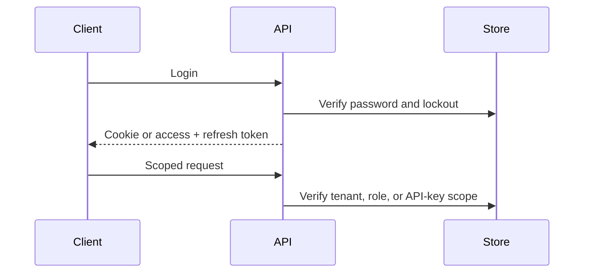

# API authentication

Web sessions use secure HTTP-only cookies. Mobile clients receive short-lived access and rotating refresh tokens stored with Expo SecureStore. Ingestion uses hashed API keys with an identifying prefix, organization scope, optional project restriction, revocation, and explicit scopes.

A production deployment can integrate an external OIDC provider such as Keycloak; the API remains the authorization boundary.
