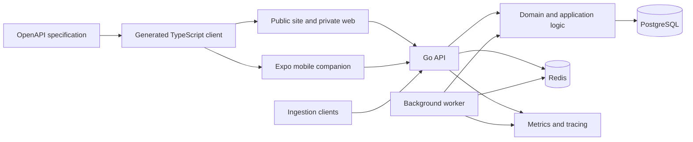

# Architecture

## Design principles

The platform is a modular monolith. Business rules remain independent of HTTP and provider adapters. SQL stays explicit through `pgx`; PostgreSQL is the system of record and Redis supports bounded operational concerns such as rate limiting and jobs. New services or packages require a current responsibility.

## Planned repository boundaries

- `apps/api`: Go HTTP service, worker, migrations, and OpenAPI source.
- `apps/web`: Next.js public website and authenticated dashboard.
- `apps/mobile`: Expo Router operational companion.
- `packages/api-client`: generated client; never hand-edited contracts.
- `packages/design-tokens`: shared tokens only when both clients consume them.
- `deployments/docker`: container definitions when introduced.

Runtime directories exist only for implemented responsibilities; the repository avoids speculative services and packages.

## Request and data flow

Ingestion authenticates a scoped, hashed API key, validates and limits the payload, redacts sensitive content before persistence, resolves effective pricing, calculates decimal-safe cost, and applies an idempotency boundary. Batch ingestion is atomic: every item is validated and prepared before a single transaction writes the batch. Exact retries require the same organization, external call ID, and payload hash; a changed payload returns a conflict. Analytics read bounded, indexed tenant-scoped ranges. Recommendation workers analyze measurable aggregates and persist rule version, evidence, and confidence inputs.

## Deployment model

The initial deployment is Docker Compose with separate non-root API/web containers plus PostgreSQL and Redis health checks. Web authentication uses secure HTTP-only cookies; mobile uses short-lived access and rotating refresh tokens. OpenTelemetry-compatible traces and Prometheus-compatible metrics share request correlation without high-cardinality labels.

## Key decisions

- Modular monolith before microservices.
- REST and OpenAPI as the cross-client contract.
- Deterministic recommendation rules before model-assisted analysis.
- Exact caching only in the initial recommendation engine.
- Simulated experiment routing in the portfolio demo.
