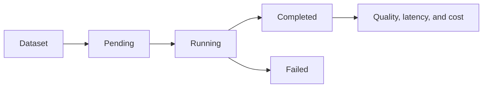

# Evaluation engine

Datasets contain sanitized cases and explicit validators: exact match, classification match, JSON Schema subset, and required fields. Runs record pass/fail counts, latency, and decimal-safe estimated cost. Automated tests use deterministic candidates and require no provider credentials.

Passing an evaluation supports an experiment decision; it does not authorize a direct production switch.
