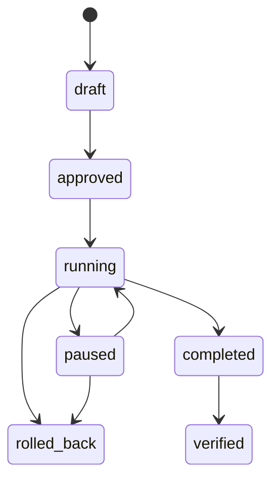

# Experiment guardrails

Experiments compare control and candidate execution with bounded candidate traffic. Quality, latency, error-rate, and cost thresholds are evaluated before completion. A violation records evidence and rolls back candidate traffic; successful completion can later become verified with measured savings.

Approval authorizes controlled testing, never an uncontrolled production switch.
