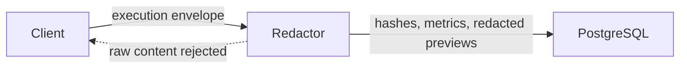

# Privacy model

Execution ingestion persists hashes, token counts, timing, cost, selected metadata, and redacted previews. Raw prompts and responses are disabled. Redaction covers credentials, authorization values, private-key markers, configured sensitive fields, and optionally contact data before persistence.

Organization scoping is applied in authenticated queries. Operators own retention, database encryption, backups, provider agreements, and lawful processing for a self-hosted deployment.
